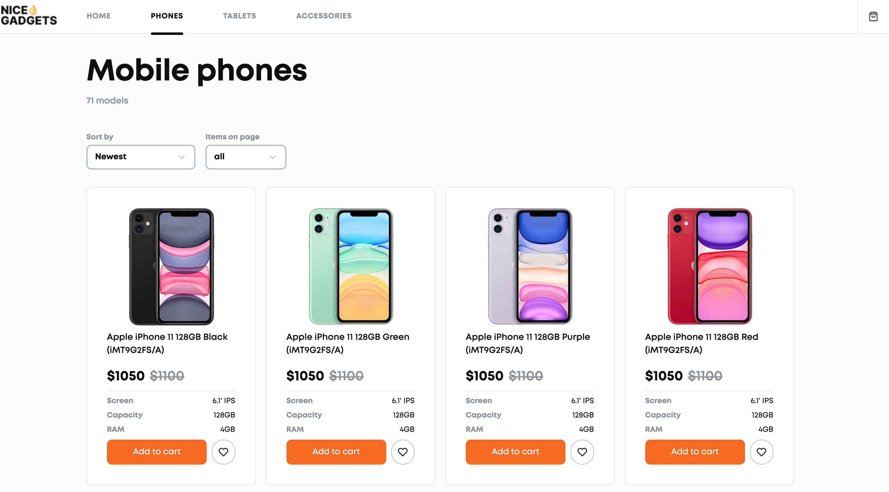

# Product catalog. Team 5

[ONLINE-CATALOG DEMO LINK](https://fe-jul22-team5.github.io/product-catalog/)

This is the demo **online-catalog** with a shopping cart and favorites page built with React / HTML5 / CSS / TypeScript / NodeJS technologies. The server is running on Heroku with a connected PostgressSQA Database. The public client is published on GH Pages.

**Design Used**: [Rounded Orange](https://www.figma.com/file/7JTa0q8n3dTSAyMNaA0u8o/Phone-catalog-(V2)-Rounded-Style-3?node-id=0%3A1)

<br/>
<p align="center">
  
</p>
<br/>

## Usage Instructions

To to run the project locally, follow these easy steps:

1. Clone the project to your local directory using HTTPS or SSH links:
```sh
HTML
$ git clone https://github.com/fe-jul22-team5/product-catalog.git
SSH
$ git clone git@github.com:fe-jul22-team5/product-catalog.git
```

2. Open the project and install all dependencies for the project in the root folder:
```
$ npm i
```

3. Instal the dependencies for the server and client in respective directories:
```
$ cd frontend && nmp i
$ cd backend && nmp i
```
4. Start the project in dev mode from the respective directory: frontend OR backend:
```
$ npm start
```
5. Enjoy your time and happy coding!

<br/>

## Useful Commands

* To deploy page to GH pages
```
$ npm run deploy
```
* To check the code style
```
$ npm run lint
```
